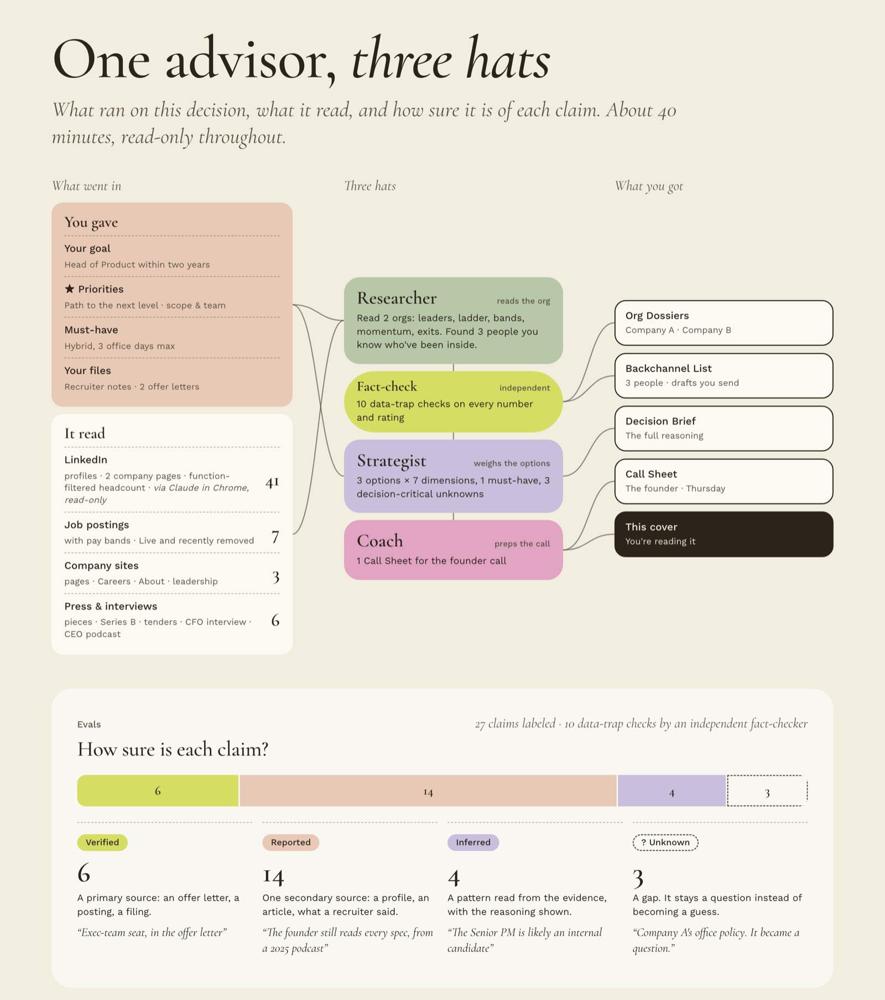
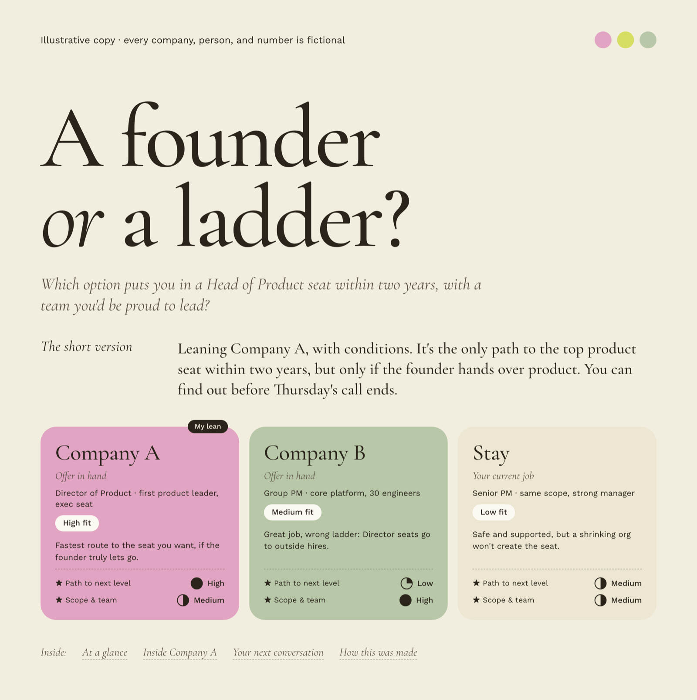
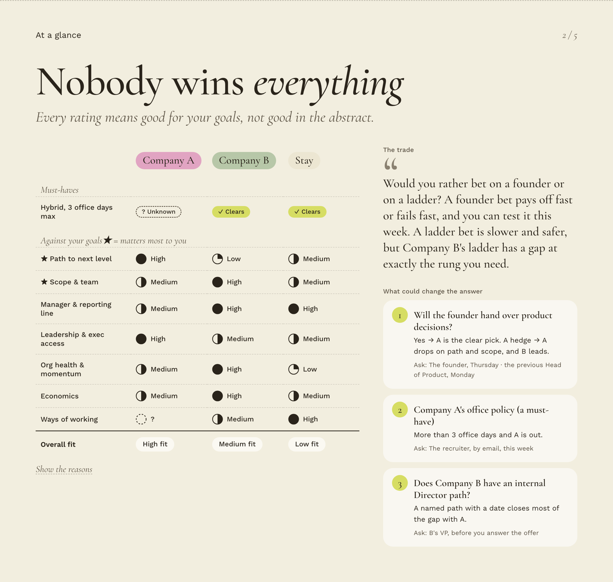
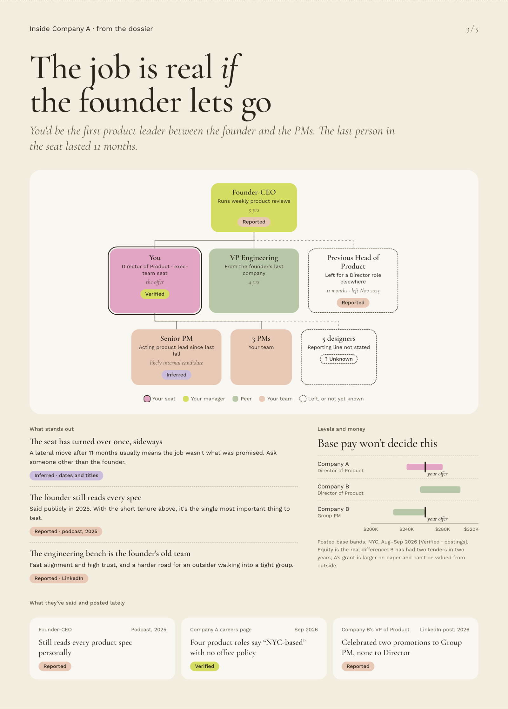
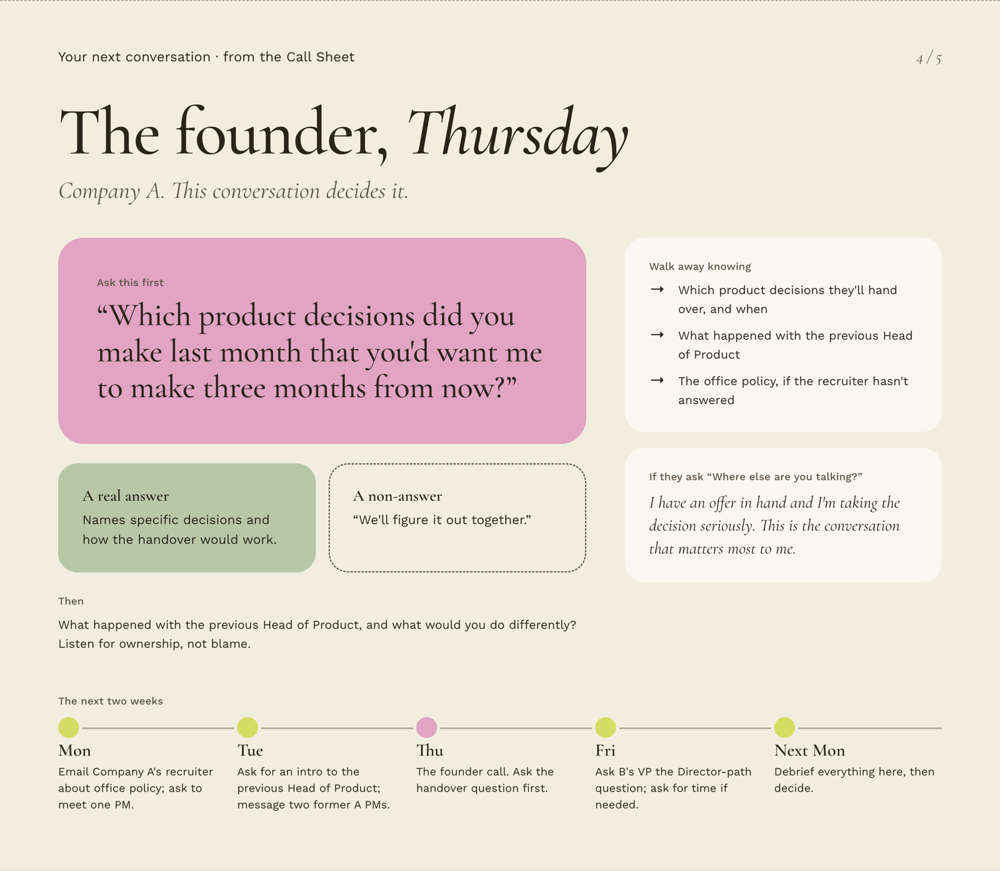

# Org Due Diligence

**Evaluate the org behind the offer.**

At a senior level you don't join a job description. You join a manager, the leaders above them, a career ladder, a team, and an org that is either growing or quietly losing its people. Companies run references and backchannels on you. This skill helps you do the same to them.

It's an agent skill for **Claude** and **Codex**, built for mid to senior professionals who are late in a process or holding an offer. It works as a **researcher, strategist, and coach in one**, and it's read-only throughout.



*The last page of every run's visual cover shows exactly what happened on that run: what you gave, what it read, which hats ran, what you got, and how sure it is of each claim. This one is illustrative, and every company, person, and number in it is fictional.*

---

## What you get

You answer a three-minute intake (every question is skippable), then choose what to run. Nothing long starts without your say-so.

| | You get | Time |
|---|---|---|
| 🔎 **Read the org** | An **Org Dossier** (1–2 pages): your manager and skip-level, how product ladders up to the execs, the founders, who held the role before, the career ladder and pay bands, momentum, recent exits, and what stands out | ~10–15 min per company |
| 🤝 **Map your network** | A **Backchannel List**: people you know who've been inside, why each one matters, and a draft note for each. You send them; the skill never does | ~5–10 min |
| ⚖️ **Compare & decide** | A **Decision Brief** (2–3 pages): the honest reframe, your options against *your* goals one by one, the money, the conversations that matter, and a dated two-week plan | ~5–10 min |
| 🎯 **Prep your next conversation** | A **Call Sheet**: the 3–5 questions that matter most, what a real answer and a non-answer sound like, and scripts for the tricky moments | ~5 min |
| 🔁 **Debrief** | Paste your notes after any call, and the brief is re-issued with a "What changed" section | ~2 min |

Then everything comes together in a **visual cover**, the first thing you open.

## The visual cover

The memos hold the reasoning. The cover makes the work visible at a glance: the research, the people, the evidence, and the next move. Here's the illustrative copy, a fictional choice between a founder-led startup, a larger company, and staying put.

**1. The decision.** Your real question, the short answer, and one card per option, rated against the two things that matter most to you.



**2. At a glance.** Every option on every dimension (High, Medium, Low, or ? for unknown), the honest trade, and the three answers that could change the recommendation.



**3. Inside the org.** Who you'd work for and alongside, who held the seat before you, what stands out, where the pay bands sit, and what leaders have said and posted lately. Every claim carries its confidence label.



**4. Your next conversation.** The one question to ask first, what a real answer sounds like, and the next two weeks.



To see it live, open [`skills/org-due-diligence/templates/cover.html`](skills/org-due-diligence/templates/cover.html) in a browser. The full fictional memos behind it are in [`examples/`](skills/org-due-diligence/examples/).

---

## How it's different from asking a chatbot

- **Goals first.** Every rating means "good for *you*", not good in the abstract.
- **Staying counts as an option.** Your current job gets rated like any offer.
- **Honest ratings.** High, Medium, or Low, never fake decimals. Unknowns stay "?", and deal-breakers are pass/fail gates that can't be averaged away.
- **Evals you can see.** Every claim that drives a rating is labeled **Verified** (a primary source), **Reported** (one secondary source), **Inferred** (a pattern, with the reasoning shown), or **Unknown** (a gap that becomes a question). An independent fact-checker runs 10 data-trap checks on every number and rating before you see anything.
- **Questions that could change your decision,** each with what a real answer sounds like and when it's cheap to ask.

## How it works

**One advisor, three hats.** The **Researcher** reads the org, the **Strategist** weighs your options against your goals, and the **Coach** gets you ready for the next conversation. They hand work to each other through the documents they write, so each part also works on its own.

```
Intake (~3 min, skippable) → Menu (you pick; it suggests where to start)
   ├─ Read the org          → Org Dossier
   ├─ Map your network      → Backchannel List
   ├─ Compare & decide      → Decision Brief
   └─ Prep your next call   → Call Sheet → after the call: Debrief → updated brief
                                   ↓
                     Visual cover, with "How this was made"
```

Where the platform supports it, separate agents do two jobs: research on several companies runs in parallel, and the fact-check runs as an independent reader that sees only the draft. Everything else stays in one conversation, so your goals and context never get lost in a hand-off.

---

## Quick start

### 1. Install

**Claude desktop app or claude.ai** (Free, Pro, Max, Team, and Enterprise plans)
1. Download [`dist/org-due-diligence.zip`](dist/org-due-diligence.zip).
2. Turn on code execution in **Settings → Capabilities**.
3. Go to **Customize → Skills → + → Create skill → Upload a skill**, and choose the zip.

**Claude Code**
```bash
git clone https://github.com/arielsnappin/org-due-diligence-skill.git
```
```bash
cp -r org-due-diligence-skill/skills/org-due-diligence ~/.claude/skills/
```

**Codex**
```bash
git clone https://github.com/arielsnappin/org-due-diligence-skill.git
```
```bash
cp -r org-due-diligence-skill/skills/org-due-diligence ~/.agents/skills/
```

### 2. Connect LinkedIn (recommended)

The most useful signals (who you'd report to, who has left, who you know there) come from LinkedIn. The skill reads them through your own browser:

1. Install **[Claude in Chrome](https://chromewebstore.google.com/detail/claude/fcoeoabgfenejglbffodgkkbkcdhcgfn)** (paid Claude plans) and sign in.
2. **Claude desktop:** open **Settings → Connectors**, turn on **Claude in Chrome**, then enable it from your chat's connectors menu. **Claude Code:** start with `claude --chrome`, or run `/chrome`.
3. Make sure you're logged in to LinkedIn in Chrome.

The skill **only reads**. It never messages, connects, follows, or changes anything.

> **Tip:** LinkedIn may show people that you viewed their profile. To browse privately, set **Settings → Visibility → Profile viewing options** to private before you start.

No LinkedIn? The skill still works from public sources, and tells you the two or three lookups worth doing yourself.

### 3. Ask

- *"I have an offer from Acme for Director of Product. Help me evaluate the org behind it."*
- *"Prep me for my call with the VP of Product at Acme tomorrow."*
- *"Who do I know at Acme who could tell me what the hiring manager is like?"*
- *"Compare my Acme offer with staying at my current job."*
- After a call: *"Here are my notes from the hiring manager call: …"*

---

## Trust and privacy

- **Read-only.** The skill never sends a message, connection request, or application, and never changes a setting. Drafts are for you to send.
- **Professional information only.** It looks at roles, tenures, and public professional activity, never anyone's personal life. It's for evaluating a prospective employer for your own decision, not for screening candidates or profiling individuals.
- **Human-scale browsing.** If LinkedIn shows a verification check or a limit, the skill stops and hands back to you.
- **Your data stays with you.** Notes, offers, and outputs are saved to a local `runs/` folder, which is git-ignored. Every example in this repo is fictional.

## What's in this repo

```
skills/org-due-diligence/       the skill (this folder is what gets installed)
  SKILL.md                      router: principles, intake → menu, routing, run log
  modules/                      intake, read-the-org, map-your-network, compare-and-decide,
                                prep-your-next-conversation, debrief, fact-check
  references/                   the quality bar, rating dimensions, confidence labels and
                                data traps, research playbook, question bank, scripts, guardrails
  templates/                    Org Dossier, Backchannel List, Decision Brief, Call Sheet,
                                and cover.html (the visual cover, with an illustrative copy built in)
  examples/                     fictional worked examples: an Org Dossier, a Decision Brief,
                                and a Call Sheet
  evals/                        test prompts and a fictional research pack with planted
                                data traps (left out of the upload zip)
docs/
  PRD.md                        the product requirements doc, with a decisions log (§13)
  images/                       the screenshots in this README
dist/org-due-diligence.zip      ready-to-upload package for Claude
scripts/package.sh              rebuilds the zip
```

## How it was built

Like a product. A naive first version (a general AI chat with LinkedIn and the web) proved the value, and its failures became requirements. The biggest was a confident headcount comparison that counted contractor networks as employees, which is why data trap #1 exists and why every number now says what it measures. From there came a [PRD](docs/PRD.md) with a decisions log, then this skill, then evals with planted traps.

## Contributing

Issues and pull requests are welcome. Product decisions live in [`docs/PRD.md`](docs/PRD.md) §13, so update the log when a decision changes. After changing anything in `skills/org-due-diligence/`, rebuild the zip:

```bash
scripts/package.sh
```

Keep every example, screenshot, and eval fictional. Real runs belong in `runs/`, which is never committed.

## License

[MIT](LICENSE)
