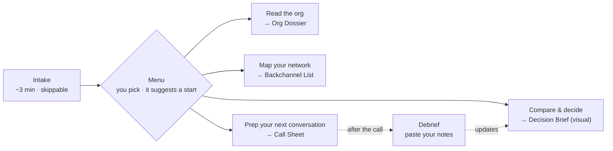

# PRD: Org Due Diligence

> **Evaluate the org behind the offer.**

| | |
|---|---|
| **Status** | Draft v0.4 (visual cover) |
| **Last updated** | 2026-09-29 |
| **Form factor** | Agent skill (`SKILL.md`) for Claude and Codex, open-sourced on GitHub |
| **Launch** | 10-minute talk + live demo |

---

## 1. TL;DR

Organizational due diligence for senior product leaders. At this level you're not joining a role, you're joining an org, and nobody teaches you how to vet one. This skill is a **researcher, strategist, and coach in one**. It reads the leadership bench, maps the career ladder, tracks recent exits, and weighs all of it against your other options, so that what you evaluate is the org behind the offer.

- **For:** senior PMs, PMMs, and product leaders (roughly 5 to 15 years of experience) who are near or at an offer.
- **Does:** reads each org, compares your options against *your* goals (staying counts as an option), and preps you for your next recruiter or hiring-manager conversation.
- **Feels like:** a sharp thinking partner, not a 50-page report. There's a three-minute intake you can skip, then you choose what to run, and every output fits on a page or two.

---

## 2. Problem

**The job description is the least important document in a senior job decision.**

With 10+ years of experience you aren't choosing a list of tasks. You're choosing:

- **a manager**, who decides what you work on and how you're represented in rooms you're not in;
- **the bench above them**, which determines how much product actually matters;
- **a ladder**, which determines where your next title and scope come from, and whether that seat exists at all;
- **a team and peers**, who determine what you can get done;
- **an org trajectory**: growing, flat, or quietly losing its people.

None of that is in the JD, and very little of it comes up in a curated interview loop.

**The information exists, but it's scattered, noisy, and time-boxed.** It lives across LinkedIn, crowd-sourced org charts, current and removed job postings, funding news, executives' public posts, and, most valuably, people in your network who've worked there. Assembling it takes hours per company. It usually has to happen inside a one-to-two-week offer window. And the raw data is full of traps that produce confident, wrong conclusions.

**The asymmetry runs one way.** The company runs references and backchannels on you. Candidates rarely do the same to the company.

**Generic AI chat helps, but fails in predictable ways** (see §4).

---

## 3. Target users

**Who it's for:** senior product people (PMs, PMMs, and adjacent product leaders) with roughly 5 to 15 years of experience who are evaluating a senior role (Staff/Principal IC, Director, Head of, VP), typically near or at the offer stage.

**Optimized for startups and scale-ups.** In a 200 to 2,000-person company, a handful of specific people shape your trajectory and public information is thin. At large public tech companies, levels are standardized and well documented elsewhere.

| Persona | Situation | The question that keeps them up |
|---|---|---|
| **The senior IC at a crossroads** *(primary)* | Staff/Principal PM, 8 to 12 years, one offer in hand, another process starting, and the option to stay | "Which of these actually gets me to the next level, and on what timeline?" |
| **The first-time Head of** | Director-level PM or PMM stepping into Head of Product or Marketing at a Series B to C startup, reporting to a founder | "Will I really own this function, or will the founder?" |
| **The inheriting manager** | Taking over an existing team as a people manager | "Who am I inheriting, and did one of them want this job?" |

**Not for (v1):** early-career search and mass applications; lateral moves inside large public tech companies; **employers or recruiters researching candidates** (explicitly out of bounds; see §9).

### Jobs to be done

1. **Understand.** When I'm close to an offer, show me the org I'd actually be joining: my reporting line, how it ladders up to the exec team, the team, and the founders.
2. **Compare.** When I have several options, staying included, compare them against *my* goals, so the most persuasive recruiter or the first offer doesn't win by default.
3. **Prepare.** When I have a recruiter or hiring-manager call coming up, tell me the questions that matter most, what a good answer sounds like, and who in my network can tell me the truth.
4. **Decide.** Help me think it through like a trusted partner would, and leave me with a clear recommendation and next moves.

---

## 4. What v0 taught us

Before writing this PRD we ran the naive version: a general-purpose AI chat with access to LinkedIn, the user's meeting notes, and the web, comparing a few outside options against staying put.

**It surfaced decision-changing insight a person would likely miss:**

- **Ladder design hidden in salary bands.** Comparing posted IC and manager bands side by side showed which senior IC tracks are real and which are decorative.
- **The honest reframe.** No option delivered everything the user wanted. Naming the actual trade was more useful than any rating.
- **Timing.** Some asks cost nothing before the interview loop and a lot after the offer.
- **Leadership pipeline patterns.** Leaders who share a prior employer say something about how the bench gets built.
- **Coaching.** It produced a sequenced, low-risk script for a delicate conversation, including what a real answer and a non-answer would sound like.

**It also failed in ways that would sink trust:**

- **A confident, wrong headcount comparison.** LinkedIn's "associated members" count included contractor networks, which inflated headcount, growth, and median tenure. The user caught the error, and the analysis had to be rewritten.
- **Uneven confidence.** Crowd-sourced org charts and self-reported titles sat next to verified facts with nothing to tell them apart.
- **Goals discovered midstream.** The user's real question only emerged halfway through, so the earlier analysis wasn't framed against it.
- **No exits analysis.** It never looked at who had left or why that matters.
- **Not shareable.** The outputs were full of real names and personal compensation.

**Implication:** the method works. The product work is making it reliable, anchored to the user's goals, short, and safe to share.

---

## 5. Goals and non-goals

**Goals**

1. **Surface what the JD doesn't say.** Every run should produce at least one decision-relevant fact or question the user didn't have before.
2. **Help the user decide.** Outputs are short, clear, and decision-oriented, with more depth on request.
3. **Anchor everything to the user's goals**, captured lightly up front.
4. **Compare fairly.** Every option, including staying, is evaluated on the same dimensions.
5. **Be trustworthy.** Every claim that matters is sourced and labeled, and the known data traps are designed out.
6. **Prepare the user for the next conversation.**
7. **Be simple to start and safe to share.** It works in Claude and Codex, is read-only on LinkedIn, and the repo contains no personal data.

**Non-goals (v1)**

- **Exhaustive reports.** If it doesn't help the decision, it doesn't go in.
- Job discovery, application tracking, or outreach automation. The skill **never sends** messages, connection requests, or InMails.
- Compensation negotiation coaching beyond flagging bands and questions to ask. This is a v2 candidate.
- Financial, legal, or tax advice, including valuing equity. The skill lists questions to ask; it doesn't price options.
- Researching anyone's personal life. Professional information only (see §9).

---

## 6. Solution overview

### 6.1 How it works: intake → menu → modules → debrief

| Module | Hat | What you get | Rough time* | Works on its own? | Better with |
|---|---|---|---|---|---|
| **Read the org** | Researcher | **Org Dossier**, a 1–2 page narrative: manager and skip-level, exec ladder and founders, role history, ladder and seats, momentum, recent exits, and what stands out | 10 to 15 min per company | Yes | Your notes |
| **Map your network** | Researcher | **Backchannel List**: people you know who've been inside, why each one matters, and a draft note for each | 5 to 10 min | Yes | Read the org (so it knows which people matter) |
| **Compare & decide** | Strategist | **Decision Brief**, a 2–3 page memo: the reframe, the options compared one by one, money, the conversations that matter, and next moves. Comes with the visual cover for the whole run | 5 to 10 min | Yes, with more unknowns | Read the org for each option |
| **Prep your next conversation** | Coach | **Call Sheet**: the 3 to 5 questions that matter, what good and evasive answers sound like, and scripts for the tricky moments | ~5 min | Yes (includes a quick scan) | Read the org + Compare |
| **Debrief** | All three | The updated brief, with a "What changed" section | ~2 min | Needs any earlier output | — |

*Time targets, to be validated in testing.

**Sequencing rules the skill uses to suggest where to start:**

- **A conversation in the next 48 hours** → start with Prep, which has a quick org scan built in.
- **Backchannel replies take days** → start Map your network early, even if it isn't the first module.
- **Compare** is most useful once the top two options have been read.
- **Nothing is required.** Skipping a module makes the others thinner, never broken, and the skill says what is thinner as a result.

### 6.2 What the user sees

**Intake**, sent as one message:

> Happy to help you look at the org behind the offer. A few quick questions first. This takes about 3 minutes, and **everything is skippable**: answer what you can, say "skip", or just give me a company name and I'll start.
>
> 1. **What are you weighing?** Company, role, and level for each option. Include staying where you are if that's on the table.
> 2. **Where are you now?** Your title, scope, and team, in a sentence.
> 3. **What do you want this move to do for you?** For example a title, more scope, AI experience, money, or stability. What does success look like in 2 to 5 years?
> 4. **Any deal-breakers?** For example location, reporting to a founder, or no path to management.
> 5. **What's your timeline?** Your offer deadline and your next scheduled conversation.
> 6. **Anything I should read?** Paste the JD, the offer, or your notes from recruiter calls.
>
> **One setup step for the LinkedIn part:** the most useful signals, like who you'd report to, who has left, and who you know there, come from LinkedIn. To use them, install the **Claude in Chrome** extension and make sure you're logged in to LinkedIn in Chrome. I'll only look; I'll never message or connect with anyone. If you'd rather not, I'll use public sources and tell you what to check yourself.

**Menu**, shown after intake:

> Here's what I can do. Pick any of them, or go with my suggestion:
>
> 1. **Read the org** (~10 to 15 min per company): your manager and skip-level, how product ladders up to the execs, the career ladder and pay bands, momentum, and recent exits.
> 2. **Map your network** (~5 to 10 min): people you know who've been inside, ranked, with a draft note for each.
> 3. **Compare & decide** (~5–10 min): your options side by side against your goals, with the honest trade-off, in a short memo plus a visual cover.
> 4. **Prep your next conversation** (~5 min): the questions that matter most, what good and evasive answers sound like, and scripts for the tricky moments.
>
> **My suggestion:** you're talking to the hiring manager Thursday, so let's read Company A first and then prep that call. I'd also start on your network now, because backchannel replies take a few days.
> Each of these works on its own, and they get sharper together.

### 6.3 What makes this different from asking a chatbot

1. **Goals first, but lightly.** A three-minute, skippable intake. The skill infers your priorities rather than making you fill in a form.
2. **A menu, not a monologue.** You choose what to run. It never launches an hour-long session you didn't ask for.
3. **Staying is an option.** Your current role is rated like any other, because it's your fallback (your BATNA).
4. **Honest ratings.** Must-haves act as gates. Everything else is rated High, Medium, or Low, with no fake precision, and unknowns stay marked "?".
5. **Trust by design.** Claims carry confidence labels, the known data traps are checked, and an independent fact-check runs before anything reaches you.
6. **Questions that could change your decision,** each with what a good answer sounds like and when it's cheap to ask.
7. **It learns as you go.** After each conversation you paste your notes into a debrief, and the picture updates.

### 6.4 Architecture decision: one advisor, three hats

**The question:** should the Researcher, Strategist, and Coach be three separate agents that talk to each other?

**Decision for v1: one advisor wearing three hats.** There is one skill and one voice to the user. Each hat is its own module with its own instructions, loaded only when needed, and that is where the specialization lives. The hats talk through shared artifacts: the Researcher writes the Dossier, the Strategist reads it and writes the Brief, and the Coach reads both. Because the interfaces are artifacts, every module can also run standalone.

**Where separate agents do earn their keep** (used when the platform supports them):

- **Parallel research.** One research agent per company handles the public-web work, so three orgs don't take three times as long and each company's context stays clean. LinkedIn browsing stays sequential, because it's one browser and the user's own account.
- **An independent fact-checker.** A skeptic reviews every number and rating against the data-trap checklist before the user sees it. v0's headcount error is exactly what a second pair of eyes catches.

**Why not three full agents:** the Strategist and Coach need the user's whole context: their goals, their reactions, what they're worried about. Splitting them creates hand-offs where that nuance gets lost. It also adds latency, cost, and setup, and makes the user feel passed around. One skill is also the simplest thing for a non-technical audience to install, and the easiest to run in both Claude and Codex.

**Revisit when** a hat needs its own tools or long-running work, such as a negotiation coach or ongoing monitoring of an org after you join.

**Packaging:** a `SKILL.md` router, one instruction file per module, shared references (dimensions, confidence labels, the trap checklist), and output templates.

### 6.5 Dependencies

- Claude (desktop, claude.ai, or Claude Code) or Codex.
- **For LinkedIn:** the Claude in Chrome extension (or Codex's equivalent browser access), logged in to the user's own LinkedIn. The skill walks the user through setup in plain language. Once connected, it can search people, companies, and jobs directly.
- **Optional connectors:** meeting notes, email, and docs.
- **Without LinkedIn access**, the skill uses public sources and tells the user what to check themselves.

---

## 7. Functional requirements

Priority: **P0** = v1 must-have · **P1** = v1 if time allows, otherwise v1.1 · **P2** = later.

### 7.0 Intake

| ID | Requirement | Pri |
|---|---|---|
| IN-1 | Send one message with at most 6 questions. Open by setting expectations: about 3 minutes, everything is skippable, and "just give me a company name" is a valid answer. | P0 |
| IN-2 | Capture the options in play (including stay), current role, goals, deal-breakers, timeline (including the next scheduled conversation), and any materials. | P0 |
| IN-3 | Explain LinkedIn setup in plain language (install Claude in Chrome, log in to LinkedIn) and promise read-only use. If the user declines, continue with public sources. | P0 |
| IN-4 | **Infer priorities** from the stated goals: mark the top 2 to 3 dimensions as ★ *matters most* and confirm them in one line ("I'm reading your priorities as path to next level and manager. Right?"). There are no weights to set. | P0 |
| IN-5 | Treat all user materials as private. | P0 |
| IN-6 | Remember the candidate profile so the next company doesn't require repeating intake. | P1 |

### 7.1 Menu and routing

| ID | Requirement | Pri |
|---|---|---|
| MN-1 | **Direct entry.** If the request names a specific module ("prep me for my call with the hiring manager tomorrow"), go straight to it, asking only what that module needs. | P0 |
| MN-2 | Otherwise, after intake, show the menu: what each module produces, rough time, and what it's better with. **Never auto-run everything.** | P0 |
| MN-3 | Recommend a starting point from the user's situation (nearest conversation, deadline, how long backchannel replies take) and explain the reason in one sentence. | P0 |
| MN-4 | Every module runs standalone. If an upstream module hasn't run, do a quick scan (about 5 minutes or less) and say what's thinner as a result. | P0 |
| MN-5 | After each module, offer the single most useful next step in one line, not a wall of options. | P0 |

### 7.2 Read the org (Researcher) → Org Dossier

Sources: the company site, LinkedIn (company, people, jobs), crowd-sourced org charts, job boards and ATS pages (including recently removed postings), press and funding data, layoff trackers, executives' public posts and interviews, review sites (low confidence), and the user's notes.

| ID | Requirement | Pri |
|---|---|---|
| RS-1 | **Leadership bench.** For the hiring manager, skip-level, functional leader, and exec team: current title, time in seat, time at the company, prior 2 to 3 roles, whether promoted internally or hired externally, and remit. | P0 |
| RS-2 | **Reporting line, exec ladder, and founders.** The chain from the role up to the CEO; whether product sits on the exec team; whether this role belongs to a leadership group; the founders' backgrounds, their involvement in product, and any co-founder departures. | P0 |
| RS-3 | **Role history.** Is this a new seat or a backfill? Who held it in the last ~3 years, and where did they go? | P0 |
| RS-4 | **Org shape and seats.** Teams or pillars and layers; how many seats exist at the user's next level. For manager roles, the team being inherited: size, seniority, tenure, and likely internal candidates for the job. | P0 |
| RS-5 | **Career ladder.** Levels and posted bands from current and recently removed postings; whether IC and manager bands are at parity; whether next-level seats are filled internally or externally. | P0 |
| RS-6 | **Momentum.** Function-filtered hiring trends *with base counts*, open reqs by function, how recent the last funding was, and any layoffs or reorgs. | P0 |
| RS-7 | **Recent exits.** Departures from leadership and from the relevant function in the last 12 to 18 months: tenure at exit, where they went, and any clusters. | P0 |
| RS-8 | **Stay option.** Light external research (momentum, exits) combined with a few quick self-assessment questions, so "stay" is rated on the same dimensions. | P0 |
| RS-9 | **Checkpoint.** Lead with the bottom line (3 bullets), key facts, and top unknowns, and invite corrections before any comparison is built on them. | P0 |
| RS-10 | **Manager track record.** Where the manager's former reports are now, and whether they were promoted after working for them. | P1 |
| RS-11 | **Hiring-network patterns** (leaders who share prior employers) and **culture signals** (executives' posts, location policy). | P1 |
| RS-12 | **Narrative dossier.** Covers: bottom line with the catch; who runs the function, compared with the alternatives; what stands out (patterns); org shape and seats; levels and money with observations and caveats; fit for you; risks, each with a question. | P0 |

### 7.3 Map your network (Researcher) → Backchannel List

| ID | Requirement | Pri |
|---|---|---|
| NW-1 | Find 1st-degree connections currently at the company, former employees in the user's network, and relevant 2nd-degree paths (noting who the mutual connection is). | P0 |
| NW-2 | Rank contacts by what they could tell the user (closeness to the role, manager, or function, and recency) and say why each person made the list. | P0 |
| NW-3 | Write one short draft note per priority contact, **for the user to send**, with 2 to 3 questions that respect the contact's time and never ask for confidential information. | P0 |

### 7.4 Compare & decide (Strategist) → Decision Brief

| ID | Requirement | Pri |
|---|---|---|
| ST-1 | **Decision frame.** Restate the user's real question in terms of their goals. | P0 |
| ST-2 | **Must-have gates.** Mark each option ✓, ✗, or ? against each deal-breaker, before any rating. | P0 |
| ST-3 | **Rating grid.** Every option (including stay) is rated **High / Medium / Low** on each dimension (§7.7), or **?** if unknown. ★ marks the user's priorities. Every rating has a one-line reason tied to evidence. No numeric scores. | P0 |
| ST-4 | **Overall fit** per option: High, Medium, or Low, or "misses a must-have", with a one-line reason and a count of the ★ unknowns still open. | P0 |
| ST-5 | **The honest reframe.** Name the actual trade, including when no option meets the goal. | P0 |
| ST-6 | **Decision-critical unknowns.** The ?s on ★ dimensions whose answers could change which option comes out ahead. These feed the Call Sheet. | P0 |
| ST-7 | **Recommendation so far**, with its conditions, what would change it, and next moves for the next two weeks. | P0 |
| ST-8 | **Visual cover.** The page the user opens first, where the platform supports it. It highlights the most important parts of every document in the run: the decision and options; the rating grid, the trade, and what could change the answer; the org chart, pay bands, and recent signals from the lead dossier; the next conversation from the Call Sheet; and "How this was made" (what went in, the three hats, what came out, and how many claims carry each confidence label). It summarizes the memos and never replaces them. | P0 |
| ST-10 | **The memo is the brief.** A dense 2–3 page memo containing: bottom line; the thing that reframes your question; how they compare; option by option; money, with caveats turned into questions; the conversations that matter (sequence, exact words, listen-fors); what could change the answer; a dated two-week plan. | P0 |
| ST-9 | **Sparring.** When the user shares a leaning or pushes back, steelman the alternative and name what would have to be true for each option to be the right call. | P0 |

### 7.5 Prep your next conversation (Coach) → Call Sheet

| ID | Requirement | Pri |
|---|---|---|
| CO-1 | **Frame the conversation:** who it's with, what role they play in the decision, and the 1 to 3 things the user wants to walk away knowing. | P0 |
| CO-2 | **3 to 5 questions,** ordered by the decision-critical unknowns (or by the biggest gaps if Compare hasn't run), phrased to be safe at this stage. | P0 |
| CO-3 | **Listen-fors:** what a real answer sounds like versus a non-answer, for each question. | P0 |
| CO-4 | **When to ask:** tag each ask as before the loop, during the loop, at the offer, or after signing. Include scripts for sensitive moments: asking for more time, asking to be considered at a higher level, asking about the predecessor, the "stay" conversation with your current manager, and mentioning a competing offer. | P0 |
| CO-5 | **Asks beyond comp:** what to clarify or get in writing, such as title, level, reporting line, scope, team, and location. | P1 |

### 7.6 Debrief (update loop)

| ID | Requirement | Pri |
|---|---|---|
| DB-1 | The user pastes notes or summarizes what they learned. The skill updates facts and labels, turns answered ?s into ratings, re-issues the Decision Brief with a "What changed" section, and suggests the next conversation to prep for. | P0 |

### 7.7 Rating dimensions

| Dimension | The question behind it |
|---|---|
| **Manager & reporting line** | Will this person grow me and advocate for me, and will they still be here in a year? |
| **Leadership & exec access** | How strong is the bench above me, how much does product matter here, and do I get a seat at the table? |
| **Path to next level** | Where does my next title or scope come from, and does that seat exist? |
| **Scope & team** | What will I actually own, and whom will I lead or work alongside? |
| **Org health & momentum** | Is the org growing and keeping its people? |
| **Economics** | How does the package compare, and how real is the equity? |
| **Ways of working** | Will I do my best work here day to day? |

**High** means a real strength for your goals. **Medium** means okay or mixed. **Low** means a real weakness or risk. **?** means we don't know yet, which is worth finding out if the dimension is ★.

---

## 8. Trust: confidence labels, data traps, fact-check

**Labels:** every factual claim carries one, with a source and access date. To keep outputs clean, labels appear inline only on claims that drive a rating. Everything else is sourced in the notes at the end.

| Label | Meaning | Example |
|---|---|---|
| **Verified** | Comes from a primary source (the company site, an official posting, a filing, or the decision-maker telling the user directly about something they control), or two independent sources agree. Spoken promises about the future stay Reported until they're in writing. | A salary band posted on the company's own careers page; the hiring manager confirming the reporting line |
| **Reported** | Comes from a single secondary source. | A self-reported LinkedIn title; a press article; something the recruiter said |
| **Inferred** | The skill's own reasoning, always shown with that reasoning. | "The removed posting suggests the seat was filled" |
| **Unknown** | A gap, which becomes a question. | Whether a Director seat is budgeted |

**Data-trap checklist:**

1. **Associated members ≠ employees.** LinkedIn company counts include contractors, partner networks, and misattributed profiles. Use function-filtered counts or company-stated headcount, and say what the number measures.
2. **Tenure has the same problem.** Median tenure across a contractor-heavy population says nothing about the product org.
3. **Small bases.** "+700%" on a base of one is noise. Always show the base.
4. **Crowd-sourced org charts lag.** Treat them as directional only, never Verified.
5. **Titles lag and hide level.** "Product @ Company" says nothing about level.
6. **Postings mislead.** Removed doesn't mean filled, reposted doesn't mean new, and bands vary by location.
7. **Valuation drifts.** The last disclosed round isn't today's value, and the preferred price isn't the 409A.
8. **Review sites skew.** Use them for themes only, at low confidence.
9. **Name collisions.** Confirm a person's identity from company, role, and timeline.
10. **Staleness.** Flag anything older than 12 months.

**FC-1 (P0), fact-check:** before any Dossier or Brief reaches the user, an independent pass (a separate agent where the platform supports one) checks every number and rating against the checklist and the labels.

---

## 9. Privacy, ethics, and platform guardrails

- **Ask first, in plain language.** The skill explains what it will look at on LinkedIn and uses it only after the user sets it up.
- **Read-only.** It never messages, connects, endorses, follows, applies, or edits anything. Drafts are for the user to send.
- **Human-scale.** It does the lookups a person would do in an evening. If LinkedIn shows a verification challenge or a limit, it stops and hands back to the user.
- **Professional information only.** That means work history, public professional posts, and company-published information. Never personal life, family, health, home location, or personal social accounts, and never inferences about protected characteristics (e.g., age from graduation year).
- **Purpose-bound.** It's for evaluating a prospective employer for your own decision, not for screening candidates or profiling individuals.
- **Fair to the people researched.** Describe patterns, not character. Thin evidence becomes a question, not a verdict.
- **Backchannel etiquette.** Never ask contacts for confidential information, and never reveal to the company who you spoke with.
- **Your data stays local.** Outputs are written to a local, git-ignored `runs/` folder. The public repo contains only a fictional example.

---

## 10. Output standards

- **Dense, not long.** Outputs are written like a sharp memo from a trusted advisor, where every sentence carries a fact, a judgment, or an action.
  - Org Dossier: 1–2 pages.
  - Decision Brief: 2–3 pages.
  - Visual cover: five short pages, one per highlight, plus how the run was made.
  - Call Sheet and Backchannel List: one page each.
- **The nuance lives in prose.** Compare every fact with the alternatives, follow every table with what it tells you, connect people and events into patterns, treat gaps as signals, and turn each caveat into a question. The quality bar is `references/what-good-looks-like.md`, with fictional worked examples in `examples/`.
- **Bottom line first**, followed by the user's real question, answered.
- **High / Medium / Low, never decimals.** Unknowns stay "?".
- **Name the trade** plainly, including the uncomfortable version.
- **Voice:** a trusted senior mentor who is direct, specific, and warm, never flattering and never alarmist.

---

## 11. Success metrics

**North star:** the share of runs where the user says the skill surfaced something that changed or sharpened their decision. This is collected through the skill's closing question and optional GitHub feedback. There is no telemetry.

| Type | Metric | Target *(proposed)* |
|---|---|---|
| Value | Users reporting at least 1 decision-relevant fact or question they didn't have before | ≥ 70% |
| Value | Users who use a Call Sheet in a real conversation (self-reported) | ≥ 50% |
| Effort | Intake | ≤ 3 min, ≤ 6 questions, all skippable |
| Effort | Time from intake to the first useful output | ≤ 10 min |
| Effort | Outputs within their length caps | 100% |
| Trust | Rating-driving claims that have a label and a source | 100% |
| Trust | Violations of known traps in the eval fixtures | 0 |
| Safety | Messages or connection requests sent | 0 |
| Safety | Personal data in the public repo | 0 |

---

## 12. Scope and milestones

| Milestone | Scope | Exit criteria |
|---|---|---|
| **v0**: naive chat | Done | Proved value and surfaced the failure modes (§4) |
| **v1**: open-source skill | All P0s, a README with plain-language setup, and a fictional demo scenario used both in the repo and in the talk | A private run on a real decision matches v0's insights without v0's errors, and the repo passes the privacy check |
| **Launch** | 10-minute talk + live demo | — |
| **v1.1** | P1s, eval fixtures with planted data traps | Passes the trap suite |
| **v2 ideas** | Comp negotiation coach; **First 90 days**, which turns the dossier into a stakeholder map once you sign | — |

---

## 13. Decisions, risks, and open questions

**Decisions log**

| Date | Topic | Decision | Why |
|---|---|---|---|
| 2026-09-29 | LinkedIn | Ask during intake, with plain-language setup (install Claude in Chrome, log in to LinkedIn); fall back to public sources | Most users won't know the setup, and LinkedIn is where the best signal is |
| 2026-09-29 | Ratings | High / Medium / Low per dimension, ? for unknowns, no numeric scores | False precision erodes trust, and decisions don't need decimals |
| 2026-09-29 | Priorities | Inferred from intake (★ top 2 to 3) and confirmed in one line; no weights | Keep it simple |
| 2026-09-29 | Codex | Assume equivalent browser and connector access | Same experience across tools |
| 2026-09-29 | Flow | Intake → menu → user-chosen modules; never auto-run everything | No hour-long runs the user didn't ask for; the user stays in control |
| 2026-09-29 | Architecture | One advisor, three hats; subagents only for parallel research and fact-checking | Specialization without losing context at hand-offs (§6.4) |
| 2026-09-29 | Output | Short by default; the Decision Brief is a visual one-pager | A decision tool, not a report |
| 2026-09-29 | Output depth (supersedes "Output" above) | Two layers. Narrative memos carry the nuance: a 1–2 page dossier and a 2–3 page brief. The visual one-pager is the cover. The quality bar is distilled from v0 into a reference plus worked examples. | First-build review: the one-pager alone lost v0's nuance (comparisons, observations, reframes, tailored coaching) |
| 2026-09-29 | Visual format | A self-contained HTML template driven by one data object. The agent fills in data and never edits layout. Markdown stays the source of truth. | Reliable rendering in Claude artifacts and as a local file, and no layout drift between runs |
| 2026-09-29 | "Verified" scope | Spoken statements count as Verified only for facts the speaker controls. Promises (promotion timing, future headcount) stay Reported until they're in writing. | Promises made during recruiting are the classic false comfort; the Coach pushes to get them in writing |
| 2026-09-29 | Visual cover (supersedes "Visual format" above) | One cover for the whole run, in a soft editorial style (warm paper, serif headlines, pastel fills). It highlights the brief, the lead dossier, and the Call Sheet, and ends with "How this was made": inputs → three hats → outputs, plus evals showing how many claims are Verified, Reported, Inferred, or Unknown. Still one data object, filled from the memos and a run log. | The first cover was a dense grid that made users read closely to find the good work. Showing the research, the people, and the evidence visually makes the value and the trust legible at a glance |

**Risks**

| Risk | Mitigation |
|---|---|
| Confidently wrong facts | Labels, the trap checklist, an independent fact-check, the checkpoint, and debriefs |
| Overwhelm or long runs | The menu, length caps, "short by default", and one suggested next step |
| Over-reliance on the recommendation | Sparring mode, and the Coach routes the user to real people |
| Platform or ToS risk on LinkedIn | Read-only and human-scale; stop on any challenge; public-sources fallback |
| Misuse to profile individuals | Professional-only, purpose-bound instructions |

**Assumptions to validate:** users will pick modules rather than asking for "everything"; the per-module time targets hold; posted bands are available for most US roles (pay-transparency laws) and less so elsewhere.

**Open questions**

1. **Final name.** Candidates: *Behind the Offer*, *Before You Sign*, or keep *Org Due Diligence*.
2. ~~License~~ Decided: MIT (2026-09-29).

---

## Revision history

- **v0.1** (2026-09-29): first draft.
- **v0.2** (2026-09-29): review feedback. Added the menu-driven flow and a skippable three-minute intake; switched to High/Medium/Low ratings with inferred priorities; adopted the one-advisor, three-hats architecture; added the Call Sheet with listen-fors; made the Decision Brief a visual one-pager.
- **v0.4** (2026-09-29): visual cover for the whole run, with a "How this was made" page and evals; run log added.
- **v0.3** (2026-09-29): first-build review. Moved to two-layer outputs: narrative memos plus a visual cover. Added a quality bar distilled from v0, fictional worked examples, and an eval that tests nuance and trap avoidance.
